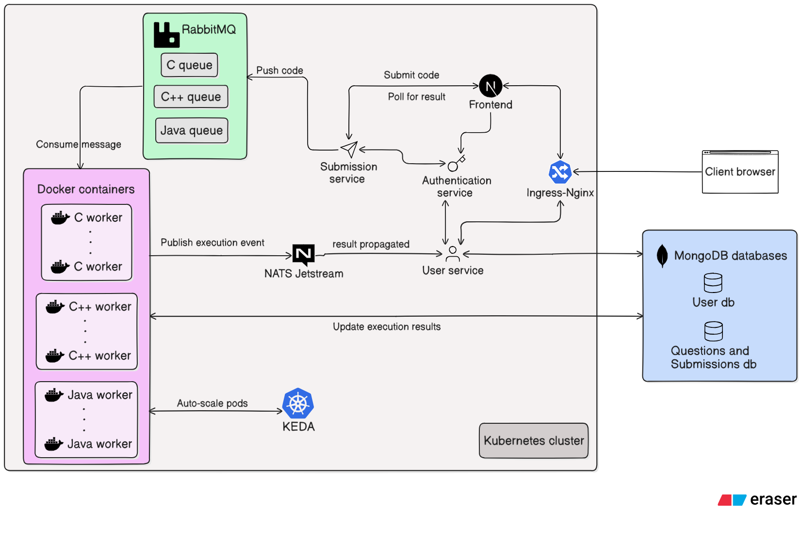

# CodePlus

A cloud-native, microservices-based, scalable code execution platform supporting multiple languages with Docker-isolated workers.

## System Design

## 🚀 Services

| Service                          | Description                       | Repository Link                                                         |
| -------------------------------- | --------------------------------- | ----------------------------------------------------------------------- |
| Frontend Service                 | Nextjs based frontend             | [Frontend srv](https://github.com/MoitreyoChak/codeplus-client-srv)     |
| Auth Service                     | Handles authentication and JWTs   | [Auth srv](https://github.com/MoitreyoChak/codeplus-auth-srv)           |
| User Service                     | Manages user profiles and history | [User srv](https://github.com/MoitreyoChak/codeplus-user-srv)           |
| Code Execution Service           | Executes code in isolated pods    | [Workers srv](https://github.com/MoitreyoChak/codeplus-codeExecWorkers) |
| Question and submissions Service | Hosts coding questions and tags   | [Question srv](https://github.com/MoitreyoChak/codeplus-ques-srv)       |
